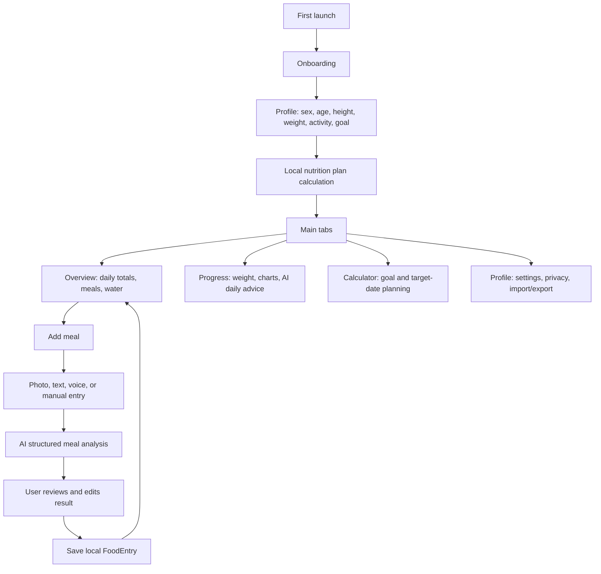
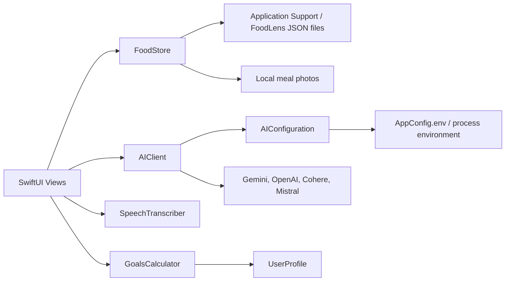

# FoodLens

FoodLens is an AI-powered iOS nutrition tracker built with SwiftUI. It helps log meals quickly, estimate calories and macros from photos or text, track water and weight, and keep daily nutrition progress visible without turning food tracking into a second job.

The app is designed as a personal nutrition assistant: local-first for private data, practical for everyday meal logging, and flexible enough to work with several AI providers.

## What FoodLens Does

- Builds a personalized nutrition plan during onboarding.
- Calculates daily targets for calories, protein, carbs, fat, fiber, and water.
- Logs meals by photo, text description, voice dictation, or manual input.
- Uses AI to estimate food name, portion weight, calories, protein, carbs, fat, confidence, assumptions, and item-level breakdown.
- Supports fast voice logging for full-day or multi-meal food lists.
- Groups food into meal slots: breakfast, second breakfast, lunch, afternoon snack, dinner, and late snack.
- Shows daily totals against targets.
- Tracks daily water intake.
- Tracks weight history and visual progress with charts.
- Generates AI-powered daily nutrition advice.
- Imports legacy food data from CSV or JSON and exports current data to CSV.
- Keeps API keys and user-specific Xcode files out of Git.

## Core User Flow



## How The Nutrition Logic Works

FoodLens separates deterministic nutrition math from AI estimation.

### Local Goal Calculation

The nutrition plan is calculated locally in `GoalsCalculator`:

- BMR uses the Mifflin-St Jeor equation.
- Maintenance calories are calculated from BMR and activity multiplier.
- Weight loss uses a controlled deficit.
- Weight gain uses a moderate surplus.
- Protein and fat targets are derived from body weight and goal type.
- Carbs are calculated from the remaining calories after protein and fat.
- Fiber is based on calories per day.
- Water target is based on body weight and activity level.
- Optional target-weight projections use the common 7,700 kcal per kg estimate.

This means the core plan does not depend on AI availability.

### AI Meal Analysis

AI is used only when the user asks the app to analyze a meal or a day. Meal analysis can use:

- a food photo,
- a text description,
- a voice transcript,
- portion notes,
- an optional explicit weight in grams.

The app sends a structured prompt to the configured provider and expects strict JSON back. The response is decoded into a `FoodEntry.Analysis` model with:

- food name,
- estimated total weight,
- calories,
- protein,
- carbs,
- fat,
- confidence score,
- assumptions,
- item-level breakdown.

Before saving, the user can review and edit the result. This keeps AI useful without making it blindly authoritative.

### Daily Nutrition Advice

The Progress screen can generate a short daily nutrition insight. FoodLens sends the selected day's totals and entries to the AI provider and stores the returned advice locally as `DailyNutritionAdvice`.

The advice is intentionally lightweight: summary, positives, improvements, and one next step.

## App Structure

```text
FoodLens/
  FoodLensApp.swift
  MainTabView.swift
  Data/
    FoodStore.swift
  Models/
    AppSettings.swift
    DailyNutritionAdvice.swift
    FoodEntry.swift
    MealType.swift
    UserProfile.swift
    WeightLogEntry.swift
  Services/
    AIClient.swift
    AIConfiguration.swift
    GoalsCalculator.swift
    LegacyImportService.swift
    SpeechTranscriber.swift
  Features/
    AddFood/
      AddMealView.swift
      QuickVoiceMealView.swift
    Main/
      OverviewView.swift
      ProgressStatsView.swift
      NutritionCalculatorView.swift
      ProfileView.swift
      EditProfileView.swift
      DataTransferView.swift
      TransferCSVDocument.swift
    Onboarding/
      OnboardingFlowView.swift
  UI/
    Buttons.swift
    CardView.swift
    DesignTokens.swift
    FloatingLabelTextField.swift
  Utilities/
    Calendar+DayKey.swift
    Date+StartOfDay.swift
    View+DismissKeyboard.swift
```

## Architecture Overview



### `FoodStore`

`FoodStore` is the app's main local state container. It is an `ObservableObject` shared through SwiftUI environment and owns:

- onboarding state,
- user profile,
- food entries,
- weight logs,
- water logs,
- daily AI nutrition advice.

It persists data as local JSON files in the app's Application Support directory.

### `AIClient`

`AIClient` is responsible for provider-agnostic AI calls. It builds prompts, defines JSON schemas, sends requests, decodes responses, and provides fallback routing when multiple providers are configured.

Supported providers:

- Google Gemini
- OpenAI
- Cohere
- Mistral

### `AIConfiguration`

`AIConfiguration` loads provider settings from `AppConfig.env` bundled with the app and merges them with process environment variables. Environment variables take priority.

### `SpeechTranscriber`

`SpeechTranscriber` wraps Apple's speech recognition and microphone APIs for voice meal input.

### `LegacyImportService`

`LegacyImportService` handles CSV/JSON import and CSV export. It supports food entries, weight logs, and water logs, while skipping duplicates during import.

## Data Stored Locally

FoodLens stores user data on device:

| Data | Model | Stored as |
| --- | --- | --- |
| Profile and nutrition goals | `UserProfile` | JSON |
| Meal diary | `FoodEntry` | JSON |
| Weight history | `WeightLogEntry` | JSON |
| Water by day | `[String: Double]` | JSON |
| Daily nutrition advice | `DailyNutritionAdvice` | JSON |
| Meal photos | Image files | Local app storage |

## Privacy And Security

FoodLens is local-first:

- Diary data, weight logs, water logs, and saved advice are stored locally.
- API keys are kept in `FoodLens/AppConfig.env`.
- `AppConfig.env` is ignored by Git.
- The repository includes only `FoodLens/AppConfig.env.example`, with empty key fields.
- Xcode user state and generated build artifacts are ignored.
- Food photos and text descriptions are sent to an AI provider only when the user explicitly runs analysis.

Important production note: this project currently uses `AppConfig.env` for local/personal builds. For a public App Store release, AI requests should ideally go through a backend or trusted proxy so provider keys are not embedded in the distributed iOS app bundle.

Current ignored private files include:

```text
FoodLens/AppConfig.env
*.env
xcuserdata/
*.xcuserstate
DerivedData/
build/
.codex.local.md
```

## Requirements

- macOS with Xcode 26.3 or newer recommended.
- iOS deployment target: 26.2.
- Swift 5.
- An optional API key for at least one supported AI provider.

The app can still run without AI configuration, but photo/text/voice analysis requires a configured provider.

## Setup

Clone the repository:

```bash
git clone git@github.com:yatkolenko/foodLens.git
cd foodLens
```

Create a local config file:

```bash
cp FoodLens/AppConfig.env.example FoodLens/AppConfig.env
```

Open the project:

```bash
open FoodLens.xcodeproj
```

Then in Xcode:

1. Select the `FoodLens` scheme.
2. Choose a simulator or a real iPhone.
3. Configure signing if needed.
4. Build and run.

## AI Configuration

Edit `FoodLens/AppConfig.env` locally:

```env
AI_PROVIDER=gemini

GEMINI_API_KEY=
GEMINI_MODEL=gemini-2.5-flash
GEMINI_FALLBACK_MODEL=gemini-2.5-flash-lite

OPENAI_API_KEY=
OPENAI_MODEL=gpt-4o-mini
OPENAI_FALLBACK_MODEL=

COHERE_API_KEY=
COHERE_MODEL=command-a-vision-07-2025
COHERE_FALLBACK_MODEL=

MISTRAL_API_KEY=
MISTRAL_MODEL=mistral-small-latest
MISTRAL_FALLBACK_MODEL=ministral-8b-2512
```

Choose one active provider:

```env
AI_PROVIDER=gemini
```

Valid values:

```text
gemini
openai
cohere
mistral
```

If multiple API keys are filled, FoodLens can try fallback providers when a request fails or a response cannot be decoded.

## Main Screens

### Onboarding

Collects the user's profile and goal:

- sex,
- age,
- height,
- weight,
- activity level,
- goal type,
- optional target weight,
- optional custom calories for weight loss planning.

It then creates the first `UserProfile` and marks onboarding as complete.

### Overview

The main daily dashboard:

- horizontal date strip,
- custom date picker,
- calories and macro totals,
- meal sections,
- add/edit/delete food entries,
- quick voice entry,
- water tracking.

### Add Meal

Supports detailed food entry:

- camera photo,
- photo library image,
- text description,
- voice dictation,
- portion notes,
- optional weight in grams,
- AI analysis,
- manual entry fallback,
- editable result before saving.

### Quick Voice Meal

Optimized for fast logging. The user can dictate a list such as a full day of meals, and FoodLens splits it into draft items with meal types and macro estimates before saving.

### Progress

Tracks longer-term behavior:

- AI daily nutrition insight,
- calories/protein history,
- weight chart,
- weight log add/delete,
- full local data reset.

### Calculator

Allows experimenting with nutrition targets and goal dates without changing the saved profile immediately.

### Profile

Shows current targets, goal projections, app settings, privacy information, and data transfer tools.

### Data Transfer

Supports:

- importing CSV,
- importing legacy JSON,
- exporting FoodLens data to CSV,
- copying an AI conversion prompt for turning screenshots from older apps into a structured CSV.

## Git Workflow

Check current changes:

```bash
git status
```

Commit a feature:

```bash
git add .
git commit -m "Add feature description"
git push
```

Before every commit, verify that no private files are staged:

```bash
git status --short
git diff --cached --name-only
```

## Roadmap Ideas

- Automated tests for `GoalsCalculator`, `LegacyImportService`, and AI response decoding.
- HealthKit integration for weight, activity, and nutrition export.
- Barcode scanning for packaged foods.
- Recipe templates and reusable meals.
- Cloud sync with explicit privacy controls.
- Better offline mode for manual-only logging.

## Project Status

FoodLens is an actively developed personal iOS app. The current focus is a reliable local nutrition diary, practical AI-assisted logging, and careful handling of private configuration.
